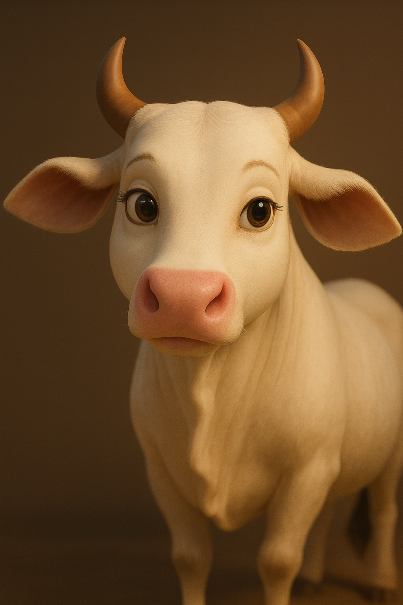

# AI Prompt Patterns and Illustrations 

## Overview 
This documentation help use AI prompts to create clear, consistent illustrations.
We will use an example to showcase the idea → draft script → build scene → character design → refine illustration prompt.

You will learn to:
- Basic prompt know-how simple, direct sentences, one idea per prompt.
- Character style notes – e.g., clothing, colors, expressions (for consistency).
- Refining prompts

## Prerequisites 
- ChatGPT (OpenAI) paid plan, recommended for better creative consistency.
- Basic Knowledge of Prompt Engineering – simple awareness of how AI responds to instructions.
- Story Idea or Script – even a rough outline of characters and settings is enough.

> Optional:
>>- A “Prompt Library” document to save your best prompts.
>>- Simple naming rules (e.g., 01_scene_forest_twilight.png).

## Getting Started 
**Customize ChatGPT**
- Sign in at chat.openai.com 
- Go to Settings → Persona;ization → Custom Instructions
- Answer the (What traits should ChatGPT have?) and (Anything else ChatGPT should know about you?)
- Save these custom instructions so you don’t have to repeat them in every session. 

## 1 AI Prompting 

**1.1 Ideation- Draft the Story**

Start by asking ChatGPT with the simple prompt, Keep  adjusting to match your vision.

_Example: Write a 12-scene story about a cow who promises a tiger she will return to keep her word._

**1.2 Decompose- Draft to Scenes**

Break the story into small, single-action scenes. each Scene = One illustration 
>Narration (what readers hear/see in text)
>>Example: 
>>With heavy steps, Cow walked into the twilight forest, her head lowered, heart heavy but firm.”

>Illustration (what the image should show)
>>Example: 
>>Cow walking alone on a narrow forest path at sunset

**1.3 Design Character**
Construct the prompt structure, avoid vague and leghty sentence. Use points Method.
>**Example**
>- Breed Style : Indigenous Indian cow 
>- Color:  White coat with faint gray shading or warm light accents
>- Eyes:  Large, soft, soulful brown eyes expressing calmness and purity
>- Face:  Pleasant and expressive
>- Posture:  Graceful, calm, often seen with her calf or peacefully grazing
>- Size: Slender but healthy, not bulky – conveys simplicity and elegance
>- Same elegant, mature Pixar-style design
>- Maintain her calm, wise expression and graceful village backdrop    
>**_Prompt: Pixar-style 3D semi-realistic, graceful white Indian cow with a pleasant, soft face, soulful brown eyes._** 

Reuse the same character description for each prompt.
If an illustration is slightly off, regenerate up to 3–4 times before rewriting the prompt

## 2 AI Prompt for Illustration

**2.1 Use Create Image in ChatGPT**

Create images by providing a description, selecting the 'Create image' option, and running the prompt. To ensure consistency across designs, use AI editing features to refine or update images as needed.

**2.2 Prompting Patterns**

Draft the prompt with all the specifications like:
- Style: Pixar-style 3D .
- Subject: Who or what is in the scene.
- Action: What they are doing.
- Setting: Background or environment.
- Mention clothing, colors, or features repeatedly for consistency. Repeat these key identifiers across all the prompts.
- If image/illustrations isnt right, tweak style or action first.
- Finally use these to structure the Prompt 
- **_Example: Pixar-style 3D illustration of a sad white cow walking on a forest path at twilight, with soft golden light filtering through tall trees, exactly matching the instructions above._**

## References

- **OpenAI ChatGPT**: [chat.openai.com](https://chat.openai.com) - Primary AI tool for illustration prompts
- **Troubleshooting Guide**: [AI Illustration Troubleshooting Guide](/blog/troubleshooting-guide) 
- Build MightyLoka