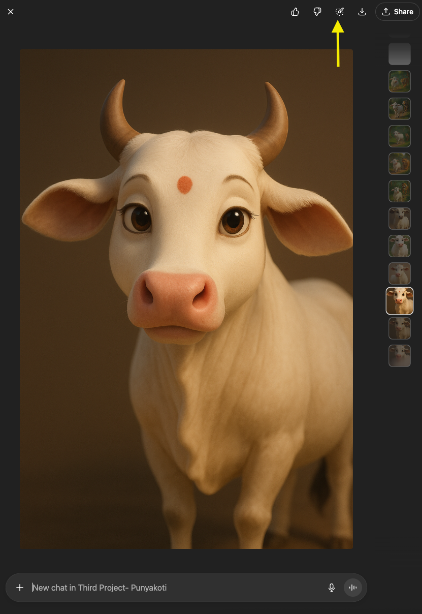

# Troubleshooting Guide

## Fixing Inconsistent AI-Generated Images  

**Overview** 

When generating illustrations with AI, characters or settings may appear differently across scenes. This guide explains common problems, causes, and solutions.  

## Common Errors 

## 1. Character Changes Between Scenes  
- **Problem:**  Character’s skin look darker in one image, lighter in another.  
- **Cause:** Missing character traits in prompt.  
- **Solution:** Reuse a consistent character description.  
 **_Refined Prompt: White cow, natural proportions, pinkish nose, brown ear tone, no garland, Pixar-style 3D.✅_**  

## 2. Unwanted Accessories  
- **Problem:** Garlands or ornaments appear.  
- **Cause:** AI fills gaps when details are vague, use simple words.  
- **Solution:** Explicitly state what must be excluded.  
  **_Refine Prompt: No garland, no tilak, no ornaments.✅_**  

## 3. Wrong Character, species or Style  
- **Problem:** Calf looks like a puppy.  
- **Cause:** Too vague description.  
- **Solution:** Add clear details.Use contsructive Prompting explain in  
    AI prompting Pattern.  
**_Refined Prompt: White calf, small body, big eyes, pinkish nose, no horns, Pixar-style 3D.✅_** 

## 4. Inconsistent Backgrounds  
- **Problem:** Forest path looks different in each scene.  
- **Cause:** Missing environmental details.  
- **Solution:** Add repeated setting description for each prompt.  
  **_Refine Prompt: Narrow forest path, twilight golden sunset, tall trees✅_**

## 5. Expression and Mood Variations  
- **Problem:** Cow looks too aggressive in a sad scene.  
- **Cause:** Missing emotional sign.  
- **Solution:** Add specific expression.  
  **_Refined Prompt:Cow with teary eyes, head bowed, gentle expression. ✅_**  

## 6. Edit image in ChatGPT
Edit an image in ChatGPT, simply click on the image and find the Select tool on the top-right corner of the window.

Select tool to select an area of the image and edit it with ChatGPT by describing changes explicitly in the prompt. 

The prompt for above image :**No Red Tilak**

## Best Practices  
- Create a **Character Style Guide** before starting. 
- Create smaller scene for illustration , one action prompt.  
- Save successful prompts in a **Prompt Library**.  
- Regenerate up to 3–4 times before rewriting the prompt.  
- Test **one variable at a time** (style, lighting, or mood). 
